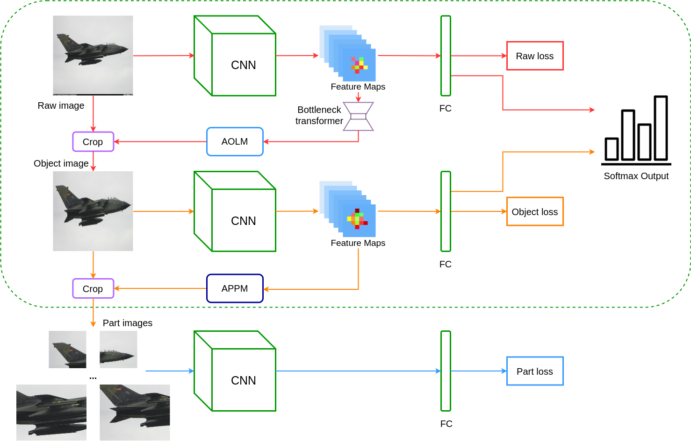

# MMMAL-Net

This is a PyTorch implementation of the MMMAL - Net based on the paper **Fine-Grained Visual Classification using Modified Multi-Branch
and Multi-Scale Attention Network**. Much of this code is reused from the [original repository]( https://github.com/ZF4444/MMAL-Net).

### Table of Contents
- <a href='#requirements'>Requirements</a>
- <a href='#dataset'>Dataset</a>
- <a href='#training L-Net'>Training MMMAL-Net</a>
- <a href='#evaluation'>Evaluation</a>
- <a href='#model'>Model</a>

## Requirements
- python 3.7
- pytorch 1.3.1
- numpy 1.17.3
- scikit-image 0.16.2
- Tensorboard 1.15.0 
- TensorboardX 2.0
- tqdm 4.41.1
- imageio 2.6.1
- pillow 6.1.0
- self-attention-cv 1.2.3

## Dataset

Download the [FGVC-Aircraft](http://www.robots.ox.ac.uk/~vgg/data/fgvc-aircraft/archives/fgvc-aircraft-2013b.tar.gz) datasets and copy the contents of the extracted **data/images** folder into **datasets/FGVC_Aircraft/data/images**)

You can also try other fine-grained datasets. 

## Training MMMAL-Net
If you want to train the MMMAL-Net, please download the pretrained model of [ResNet-50](https://drive.google.com/open?id=1raU0m3zA52dh5ayQc3kB-7Ddusa0lOT-) and move it to **models/pretrained** before run ``python train.py``. You may need to change the configurations in ``config.py`` if your GPU memory is not enough. The parameter ``N_list`` is ``N1, N2, N3`` in the original paper and you can adjust them according to GPU memory. During training, the log file and checkpoint file will be saved in ``checkpoint`` directory. 

## Evaluation
If you want to test the MMMAL-Net, just run ``python test.py``. You need to specify the ``model_path`` in ``test.py`` to choose the checkpoint model for testing.

## Model
We also provide the checkpoint model trained by ourselves for 60 epochs on FGVC-Aircraft daataset, you can see it at **checkpoint/aircraft/epoch58.pth** with 94.21% test accuracy.

